# Emarket

Welcome to Emarket, a specialized e-commerce platform for LEGO enthusiasts aged 4 to 18 years. Whether you're a young builder starting with simple designs or a seasoned teenager diving into complex constructions, Emarket has something for everyone.

Our goal is to make LEGO products accessible, inspiring creativity and fun for all age groups within this range. A list of these can be found in Stripe's documentation [here](https://stripe.com/docs/testing#cards).

The live link can be found here - [Emarket](https://emar-423e8a6d3ba4.herokuapp.com/)

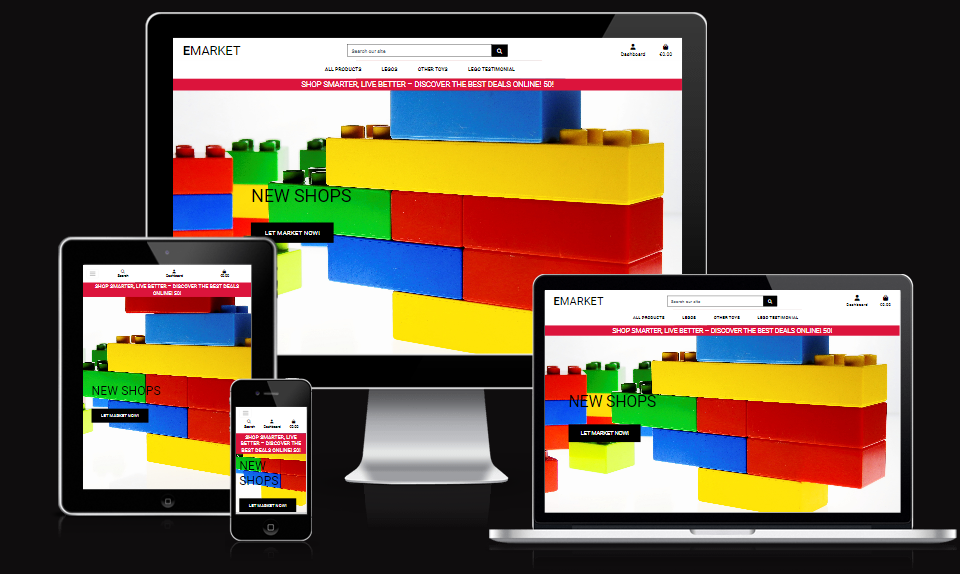


- [User Experience (UX)](#user-experience--ux-)
  * [User Stories](#user-stories)
    + [EPIC | Viewing and Navigation](#epic---viewing-and-navigation)
    + [EPIC | User Account and Profile](#epic---user-account-and-profile)
    + [EPIC | Purchasing](#epic---purchasing)
    + [EPIC | Admin & Store Management](#epic---admin---store-management)
- [Data Schema and Relationships](#data-schema-and-relationships)
  * [Design](#design)
    + [Colour Scheme](#colour-scheme)
    + [Imagery](#imagery)
    + [Fonts](#fonts)
    + [Wireframes](#wireframes)
- [Agile Methodology](#agile-methodology)
  * [Database Security](#database-security)
- [Features](#features)
  * [Header](#header)
  * [Home Page](#home-page)
  * [User Account Pages](#user-account-pages)
  * [Profile](#profile)
  * [All Product (Products)](#all-product--products-)
  * [Bag](#bag)
  * [Checkout](#checkout)
  * [Testimonials](#testimonials)
  * [Evaluation Form](#evaluation-form)
  * [Subscribe to Us](#subscribe-to-us)
  * [Contact Us](#contact-us)
- [Business Model](#business-model)
  * [** Business Plan**](#---business-plan--)
  * [**Key Performance Indicators (KPIs)**](#--key-performance-indicators--kpis---)
  * [**Investment Requirements**](#--investment-requirements--)
- [Social Media Marketing.](#social-media-marketing)
- [Testing](#testing)
- [Deployment - Heroku](#deployment---heroku)
  * [Create the Heroku App:](#create-the-heroku-app-)
  * [Attach the Postgres database:](#attach-the-postgres-database-)
  * [Update Heroku Config Vars](#update-heroku-config-vars)
  * [Deploy](#deploy)
- [AWS Set Up](#aws-set-up)
  * [AWS S3 Bucket](#aws-s3-bucket)
  * [IAM](#iam)
  * [Connecting S3 to Django](#connecting-s3-to-django)
- [Forking this repository](#forking-this-repository)
- [Cloning this repository](#cloning-this-repository)
- [Languages](#languages)
- [Frameworks - Libraries - Programs Used](#frameworks---libraries---programs-used)
- [Credits](#credits)
- [Acknowledgments](#acknowledgments)

<small><i><a href='http://ecotrust-canada.github.io/markdown-toc/'>Table of contents generated with markdown-toc</a></i></small>


## User Experience (UX)

A visitor to Fresh Nest would be someone who is most likely an adult who is interested in buying luxurious interior products and high-end interior design services.

### User Stories

#### EPIC | Viewing and Navigation
- As a Site User, I can intuitively navigate around the site so that I can find content.
- As a Site User, I can view a list of products so that I can select a product to view.
- As a shopper, I can view a specific category of products so I can browse the type of products I'm looking for.
- As a shopper, I can search all products so that I can find what I am looking for.
- As a shopper, I can sort all products so that I can view products based on price, age or title.
- As a site user, I can view a list of LEGO product categories so I can understand what each category offers and choose the most suitable sets for my interests and skill level.
- As a site user, I can read LEGO STORY left by other LEGO enthusiasts so I can see their feedback on the LEGO sets they purchased and their overall experience.
- As a site user, I can view pictures of completed LEGO builds from other users so I can get inspired by their creations and build trust in the quality of the products offered.

#### EPIC | User Account and Profile
- As a site user, I can register an account so that I can have a personal account.
- As a site user, I can log in or log out of my account so that I can keep my account secure.
- As a site user, I can see my login status so that I know if I'm logged in or out.
- As a site user, I can save my personal details in my user profile so that I do not have to fill them out for future orders.
- As a site user, I can view my order history so that I can remember what purchases I've made.
- As a site user, I can recover my password in case I forget it so that I can recover access to my account.

#### EPIC | Purchasing
- As a shopper, I can add a number of products in different age group to my shopping bag so that I can purchase them all together when I am ready.
- As a shopper, I can view a running total of my shopping bag as I am shopping so that I can see how much it costs in total.
- As a shopper, I can view the contents of my shopping bag at any time so I can see what is included and the total cost.
- As a shopper, I can adjust the quantity of individual products in my bag so that I can easily make changes before I purchase.
- As a shopper, I can see a summary of my shopping cart when I checkout so that I know what products are included and the total cost before I commit to purchasing.
- As a shopper, I can easily enter my payment information securely so that I can purchase my chosen products quickly with no issues.
- As a shopper checkout as a guest so I don't have to sign up for an account.
- As a shopper, I can view an order confirmation after checkout so that I know my purchase was successful.
- As a shopper, I can receive an email confirmation of my order so that I have a record of my purchase.


#### EPIC | Admin & Store Management
- As a store owner, I can add products through an easy-to-use interface so that I can manage the store's contents.
- As a site user, you can complete the form of contact and we will be in touch.
- As a site user, you can also submit a form of evaluation.
- As a site owner, I created a page 404 - for page yet to be found.

## Data Schema and Relationships

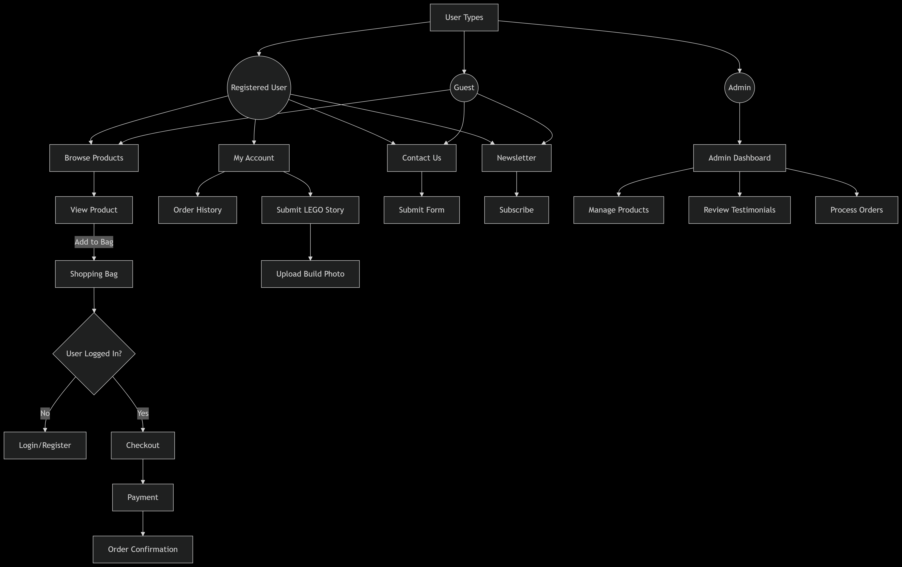
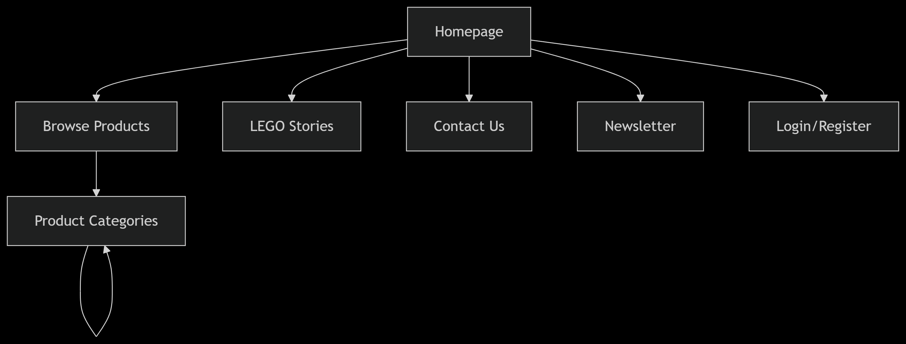


### Design

The site features an elegant and clean design, enhanced by subtle yellow-green background details that evoke a sense of luxury and sophistication.

#### Colour Scheme

Colour palette from Coolors


The color scheme of the LEGO Emarket site is based on a balanced mix of gold, light grey, and dark grey. These colors are deliberately chosen to maintain a neutral yet engaging environment, allowing the LEGO sets and their details to take center stage without unnecessary distractions. Gold accents add a touch of elegance and luxury, evoking the joy and excitement that LEGO brings, while still staying true to the playful spirit of the brand.
Light grey is used throughout the background to keep the design clean and modern, while dark grey provides a contrasting element for text and key sections, ensuring clear readability and balance.

Care was taken to establish a strong contrast between the background colors and text throughout the site, ensuring maximum user accessibility. The neutral tones create a user-friendly experience, allowing the LEGO products to shine while ensuring a smooth browsing experience for all visitors.

#### Imagery
The site features a prominent static image on the homepage showcasing an exciting and engaging LEGO set. The color scheme of the site, with its green and yellow tones, complements this main image, reflecting the vibrant, playful, and imaginative nature of LEGO building. These colors provide a lively and energetic feel, enhancing the overall experience for users.

#### Fonts
The primary font used for the body of the LEGO Emarket site is Roboto, a versatile and modern sans-serif font that ensures optimal readability and a smooth browsing experience. This font was imported via Google Fonts to guarantee consistent appearance across different devices.

#### Wireframes

<details>
 <summary>Home Page</summary>


</details>

<details>
 <summary>Products</summary>


</details>


<details>
 <summary>Checkout</summary>


</details>

<details>
 <summary>Order Confirmation</summary>

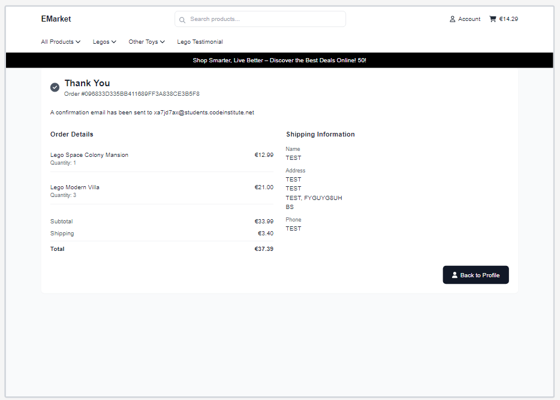
</details>

<details>
 <summary>Lego Testimonial</summary>
 
 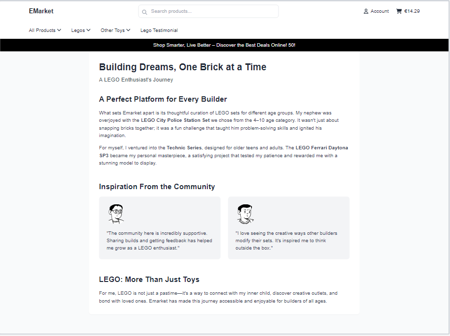
</details>

<details>
 <summary>Dashboard</summary>

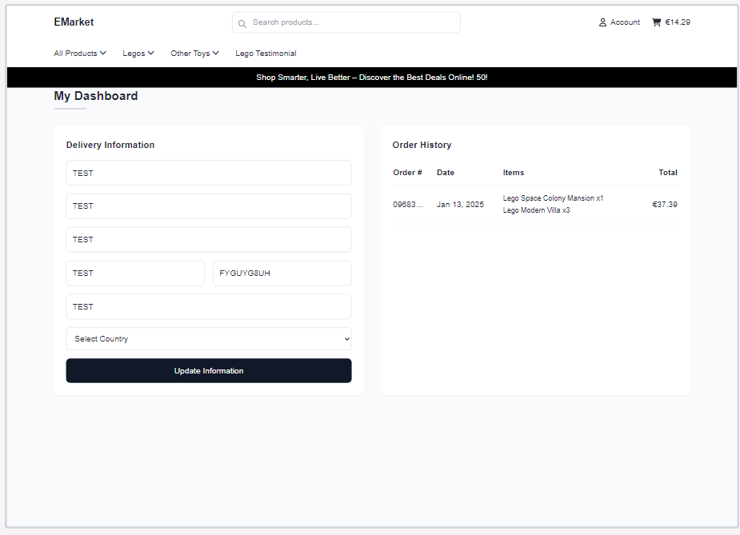
</details>


<details>
 <summary>Contact Us</summary>

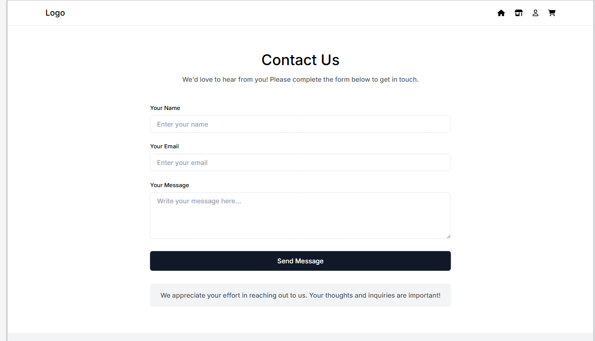
</details>


<details>
 <summary>Evaluation</summary>

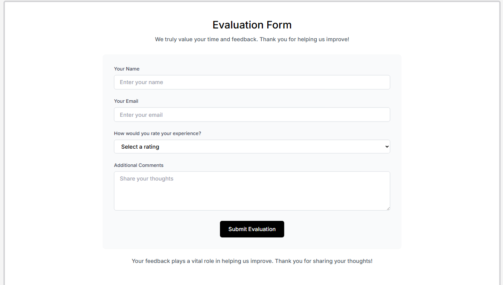
</details>

## Agile Methodology
Github projects was used to manage the development process using an agile approach. Please see link to project board [here](https://github.com/users/SamAkinbile/projects/3/views/1?visibleFields=%5B%22Title%22%2C%22Assignees%22%2C%22Status%22%2C%22Labels%22%5D&layout=board)


The Epics listed above were documented within the Github project as Milestones. A Github Issue was created for each User Story which was then assisgn, label, . Each User Story has defined acceptance criteria to make it clear when the User Story has been completed. The acceptance criteria are further broken down into tasks to facilitate the User Story's execution.


### Database Security
The database url and secret key are stored in the env.py file to prevent unwanted connections to the database. Stripe keys and wh secret are also stored in the env.py file. 


## Features

### Header


**Logo**
- A customised logo was created using Code Institute template.
- This logo is positioned in the top left of the navigation bar. The logo is linked to the home page for ease of navigation for the user.

**Navigation Bar**

- The navigation bar is visible at the top of every page and includes links to the other pages.

**Search Bar**


- The search bar displays above the nav bar.
- On smaller screens, this bar becomes a search icon which when clicked will drop down the full bar.
- Any searched word will match itself to any text in the product's title, or description and display the results on the product's page.


**User Icon**

- The User icon navigation link is a drop down menu which includes the Sign up and Log in links. 
- Once a user has signed in, their username will display beside the user icon.
- The options to Sign up or Log in will change to the option to log out once a user has logged in.
- Once a user has signed in, the 'My Profile' option becomes available in the User dropdown.

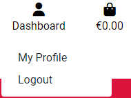

- If the user has signed in, options such as 'profile' and 'logout/login' become available in the User dropdown.

**Bag Icon**


- Located on the right side of the navbar next to the User icon is the bag Icon.
- Once a product is added to the bag, a number displaying the total quantity of items appears, located at the top right of the bag icon.
- As the user adds products to their bag, a toast message appears in the top right-hand corner of the screen informing the user that the item has been added, giving them a snapshot of the bag contents and the total cost of the bag.

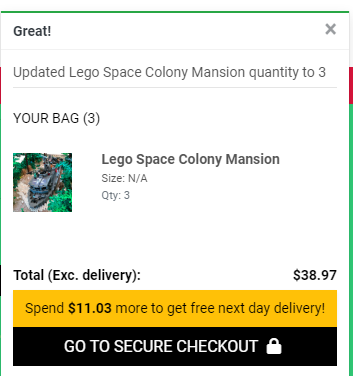
- Clicking the bag icon navigates the user to the shopping bag page which displays a summary of what's been added.


### Home Page

**Call to Action Section**
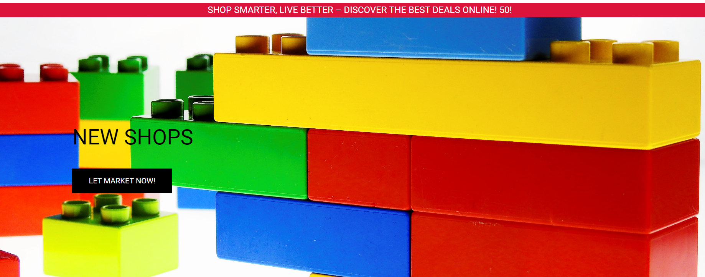

The LEGO-themed home page features an engaging call-to-action section, inviting users to "Shop Now" or explore "more legos action." This section is highlighted with the message "NEW SHOPS" alongside an image of a creatively styled LEGO, sparking inspiration and curiosity.


### User Account Pages

**Sign Up**


**Sign In**

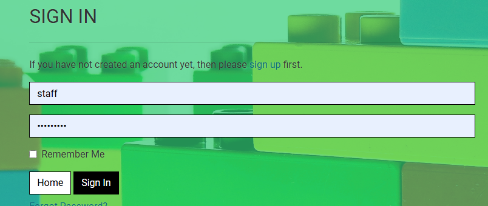

**Log Out**
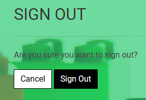

- Django allauth was installed and used to create the Sign up, Log in and Log out functionality. 
- Success messages inform the user if they have logged in/ logged out successfully.
- When a user signs up for an account they must verify their email address by clicking on the authentication link emailed  to the address they provided.
- If a user forgets their password they can reset it by clicking the 'Forgot Password' on the log in page.


### Profile


- Users can easily amend and save thier information if so wish. This can be done clicking "Save Information"
- The delivery details section stores the user's delivery address and phone number.
- The information provided here is used to autofill the delivery address when placing an order.

**Order History**


- The order history section displays a list of every order the user has placed.
- The table displays the order number, date it was ordered and the order total.
- Clicking the order number will take the user to a summary page of that order.


### All Product (Products)
 


- The 'All Product' link will display a list of all products from the database.
- Clicking any of the categories will filter the products to only show products from the category selected.
- The category selected will display as the page heading.


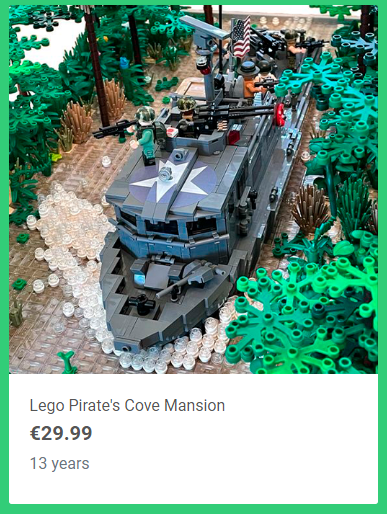

- Each product card shows an image of the product, its title, excerpt and price.
- The products page is fully responsive, adjusting how many products are on each row depending on the user's screen size.
- A sort box is located on the products page where users can sort all products by price in ascending or descending order and by title (A-Z).


**Quantity Buttons**
- The quantity buttons are located underneath the product details and are used to add items to the bag.
- The plus and minus buttons increase and decrease the input value.
- If the value is set to 1 the minus quantity will be disabled. Respectively if the value is set to 99 the plus button is disabled.
- Clicking the 'Add to Bag' button takes the number in the input field and adds that amount of products to the bag.
- Clicking the 'Keep Shopping' button takes the user back to the store.


### Bag


- When the user clicks on the shopping bag icon beside the dashboard in the nav bar they are taken to the shopping bag page which shows the products which the user has added to their cart, unit price, quantity and subtotal.

**Update and Remove Buttons**


- Clicking the 'update' icon button saves any changes to the quantity and updates the item's subtotal.
- Clicking the 'Remove' icon button delete the item completely from the user's bag.
- If the user manually types in a negative number and clicks 'update', the item will be removed from the item from the bag.


**Total Section**
- At the end of the line items is a summary of the costs.
- The summary features the bags total, delivery cost and the grand total to pay.
- Underneath the grand total users will find a message informing them of how much more they need to spend to receive free delivery if they haven't already met the free delivery threshold. 
- Beneath the grand total is two buttons. From there the user can either continue to the checkout or return to the products page.

### Checkout 


**Details**
- Within the details section the user can fill out their contact details, delivery address, and card number.
- If the user is a guest, a link to create an account or login will be present.
- If the user is signed in a checkbox to save the delivery information can be checked.
- If the user is signed in and has delivery information saved, the delivery details and email address will be automatically filled in.
- If a user leaves a required field empty, inputs whitespace in a required field or includes text in the phone number field an error message will prompt the user to 'Fill in the field' or 'match the format requested'

**Order Summary**
- The order summary section details all the items about to be purchased, along with the quantity, subtotal and a grand total.
- Next to the order summary title will be a number reflecting the total number of items that appear in the order.
- Clicking the product image in the summary will take the user to that product's detail page.

**Payment**
- The card payment is handled by Stripe to ensure secure payment.
- Incorrect card numbers will automatically show an invalid card number error.
- A loading screen will appear when a payment is being processed to stop the user clicking away.
- Once the payment is processed, the webhook will search the database to confirm the order exists. If it cannot find it, it will create one using the payment information.

**Confirmation**

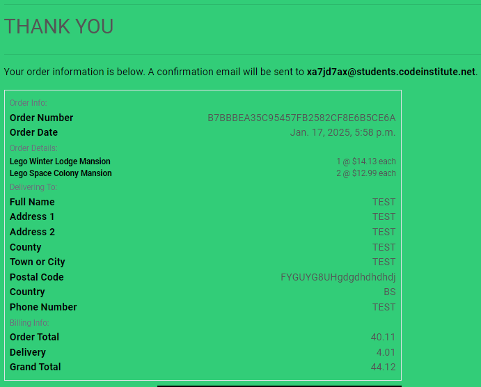
- Once the order has been processed the user is taken to the checkout success page.
This page summarises the completed order.
- An email will be sent to the user with their order confirmation

### Testimonials

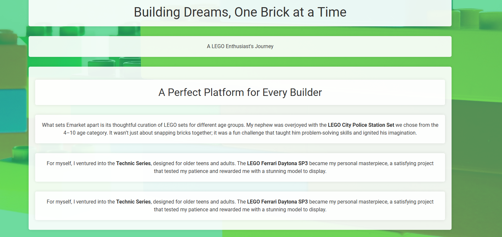
- The LEGO STORY page can be accessed by clicking the link in the nav bar.
- When the user navigates to the Testimonials page they can see all story generate by their experience. 

### Evaluation Form

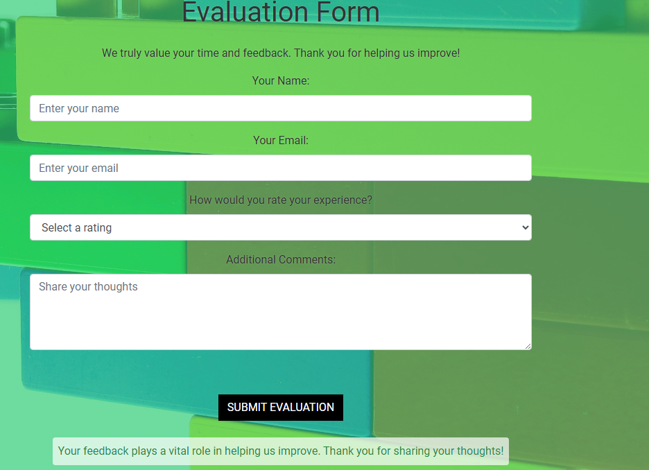

- Where user can contribute directly or indirectly to the UI/UX of the website and also contribute pertaining to the product.

### Subscribe to Us

 

- This is to get the user follow alog with our update marketing.

### Contact Us

- You could get to us by completing the contact us form. We shall get back to you in due course.


**Page 404 ***

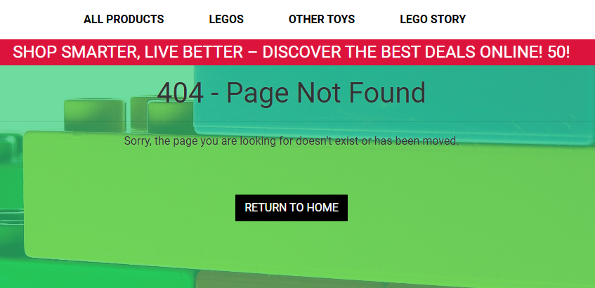

- A 404 page is the error page displayed when a requested resource cannot be found on the server.

## Business Model
E-Market's business model is Business to Consumer (B2C). Products and services are sold directly from E-Market to consumers who are the end-users.


### ** Business Plan**

| **Section**          | **Key Components**                                                                 | **Details**                                                                 |
|----------------------|------------------------------------------------------------------------------------|-----------------------------------------------------------------------------|
| **Business Overview** | - Business Name<br>- Legal Structure<br>- Mission Statement                        | EMAR - LEGO-focused e-commerce platform. Mission: "Deliver authentic LEGO experiences with seamless shopping." |
| **Market Analysis**   | - Target Audience<br>- Competitors<br>- Market Trends                              | Parents (25-45), collectors. Competitors: LEGO Store, Amazon. Trend: Niche LEGO resale market growing at 8% CAGR. |
| **Revenue Streams**   | - Product Sales<br>- Subscriptions (Newsletter Premium)<br>- Future: Workshops     | 80% from LEGO sets, 15% accessories, 5% customization services.            |
| **Cost Structure**    | - Inventory<br>- Platform Hosting<br>- Marketing                                   | Heroku hosting ($50/mo), Shopify payments (2.9% + $0.30/transaction), Google Ads ($500/mo). |
| **Marketing Strategy**| - SEO<br>- Social Media<br>- Email Campaigns                                       | Pinterest/Instagram LEGO builds, Google Shopping ads, abandoned cart emails. |
| **Operations**       | - Suppliers<br>- Fulfillment<br>- Customer Support                                | Dropship from LEGO-certified EU/US warehouses. Zendesk for support tickets. |
| **Financial Projections** | - Year 1-3 Sales<br>- Break-even Analysis                                    | Year 1: $120K revenue, 15% profit margin. Break-even at 800 orders/month.  |
| **Technology Stack**  | - Frontend<br>- Backend<br>- Payment Gateway                                      | Django/PostgreSQL, Stripe, AWS S3 for media.                               |
| **Risk Management**   | - Inventory Risks<br>- Fraud Prevention                                           | Use LEGO's "Dropship" program to avoid overstocking. Implement Stripe Radar for fraud. |
| **Milestones**       | - Launch Phase<br>- Expansion                                                     | Q1: Launch core store. Q3: Add AR LEGO preview feature.                    |

---

### **Key Performance Indicators (KPIs)**
| **Metric**           | **Target**          | **Measurement**                                                     |
|----------------------|---------------------|---------------------------------------------------------------------|
| Monthly Active Users | 5,000               | Google Analytics                                                    |
| Conversion Rate      | 3.5%                | Orders ÷ Sessions                                                   |
| Average Order Value  | $85                 | Revenue ÷ Orders                                                    |
| Customer Retention   | 30% repeat buyers   | Shopify CRM tracking                                                |

---

### **Investment Requirements**
| **Area**             | **Initial Cost**    | **Ongoing Cost**                                                   |
|----------------------|---------------------|--------------------------------------------------------------------|
| Platform Development | $15,000 (one-time) | $300/month (maintenance)                                           |
| Inventory            | $20,000            | Replenished quarterly                                              |
| Marketing            | $8,000/year        | Adjusted based on ROI                                              |


## Social Media Marketing.

- A social media maeketing page have been created for this buisness. Facebook work is still on going.

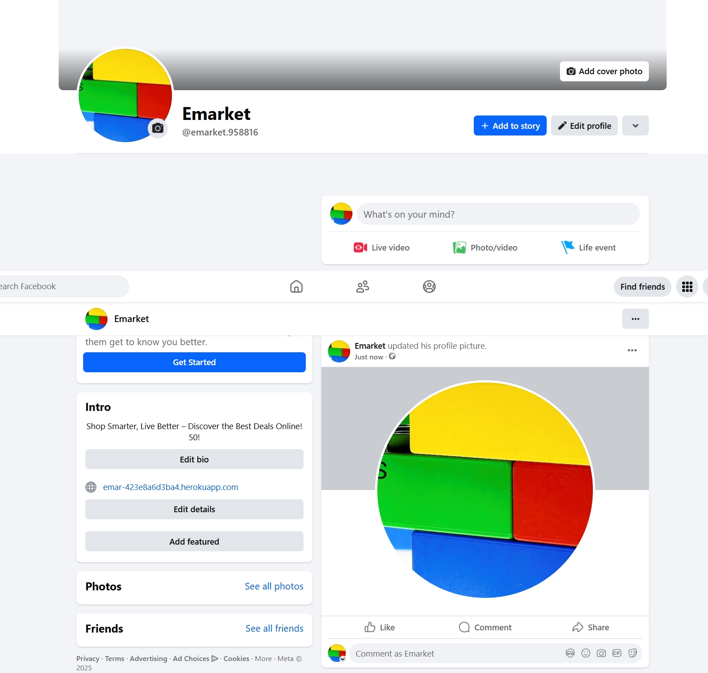

## Testing
Testing and results can be found [text](TESTING.md)

## Deployment - Heroku

To deploy this page to Heroku from its GitHub repository, the following steps were taken:

### Create the Heroku App:
- Log in to [Heroku](https://dashboard.heroku.com/apps) or create an account.
- On the main page click the button labelled New in the top right corner and from the drop-down menu select "Create New App".
- Enter a unique and meaningful app name.
- Next, select your region.
- Click on the Create App button.

### Attach the Postgres database:
- In the Resources tab, under add-ons, type in Postgres and select the Heroku Postgres option.
- Copy the DATABASE_URL located in Config Vars in the Settings Tab.
- Go back to your IDE and install 2 more requirements:
    - `pip3 install dj_databse_url`
    - `pip3 install psycopg2-binary` 
- Create requirements.txt file by typing `pip3 freeze --local > requirements.txt`
- Add the DATABASE_URL value and your chosen SECRET_KEY value to the env.py file. 
- In settings.py file import dj_database_url, comment out the default configurations within database settings and add the following: 

```
DATABASES = {
    'default': dj_database_url.parse(os.environ.get('DATABASE_URL'))
}
```
- Run migrations and create a superuser for the new database. 
- Create an if statement in settings.py to run the postgres database when using the app on heroku or sqlite if not

```
    if 'DATABASE_URL' in os.environ:
        DATABASES = {
            'default': dj_database_url.parse(os.environ.get('DATABASE_URL'))
        }
    else:
        DATABASES = {
            'default': {
                'ENGINE': 'django.db.backends.sqlite3',
                'NAME': BASE_DIR / 'db.sqlite3',
            }
    }
```

- Create requirements.txt file by typing `pip3 freeze --local > requirements.txt`
- Create a file named "Procfile" in the main directory and add the following: `web: gunicorn project-name.wsgi:application`
- Add Heroku to the ALLOWED_HOSTS list in settings.py in the format ['app_name.heroku.com', 'localhost']

- Push these changes to Github.

### Update Heroku Config Vars
Add the following Config Vars in Heroku:

|     Variable name     |                           Value/where to find value                           |
|:---------------------:|:-----------------------------------------------------------------------------:|
| AWS_ACCESS_KEY_ID     | AWS CSV file(instructions below)                                               |
| AWS_SECRET_ACCESS_KEY | AWS CSV file(instructions below)                                               |
| DATABASE_URL          | Postgres generated (as per step above)                                        |
| EMAIL_HOST_PASS       | Password from email client                                                    |
| EMAIL_HOST_USER       | Site's email address                                                          |
| SECRET_KEY            | Random key generated as above                                                 |
| STRIPE_PUBLIC_KEY     | Stripe Dashboard > Developers tab > API Keys > Publishable key                |
| STRIPE_SECRET_KEY     | Stripe Dashboard > Developers tab > API Keys > Secret key                     |
| STRIPE_WH_SECRET      | Stripe Dashboard > Developers tab > Webhooks > site endpoint > Signing secret |
| USE_AWS               | True (when AWS set up - instructions below)                                   |

### Deploy
- NB: Ensure in Django settings, DEBUG is False
- Go to the deploy tab on Heroku and connect to GitHub, then to the required repository. 
- Scroll to the bottom of the deploy page and either click Enable Automatic Deploys for automatic deploys or Deploy Branch to deploy manually. Manually deployed branches will need re-deploying each time the repo is updated.
- Click View to view the deployed site.

The site is now live and operational.


## AWS Set Up
### AWS S3 Bucket
- Create an AWS account.
- From the 'Services' tab on the AWS Management Console, search 'S3' and select it.
- Click 'Create a new bucket', give it a name(match your Heroku app name if possible), and choose the region closest to you.
- Under 'Object Ownership' select 'ACLs enabled' and leave the Object Ownership as Bucket owner preferred.
- Uncheck block all public access and acknowledge that the bucket will be public.
- Click 'Create bucket'.
- Open the created bucket, go to the 'Properties' tab. Scroll to the bottom and under 'Static website hosting' click 'edit' and change the Static website hosting option to 'enabled'. Copy the default values for the index and error documents and click 'save changes'.
- Open the 'Permissions' tab, locate the CORS configuration section and add the following code:
```
[
  {
      "AllowedHeaders": [
          "Authorization"
      ],
      "AllowedMethods": [
          "GET"
      ],
      "AllowedOrigins": [
          "*"
      ],
      "ExposeHeaders": []
  }
]
```
- In the 'Bucket Policy' section and select 'Policy Generator'.
- Choose 'S3 Bucket Policy' from the type dropdown.
- In 'Step 2: Add Statements', add the following settings:
    - Effect: Allow
    - Principal: *
    - Actions: GetObject
    - ARN: Bucket ARN (copy from S3 Bucket page)
- Click 'Add Statement'.
- Click 'Generate Policy'.
- Copy the policy from the popup that appears
- Paste the generated policy into the Permissions > Bucket Policy area.
- Add '/*' at the end of the 'Resource' key, and save.
- Go to the 'Access Control List' section click edit and enable List for Everyone (public access) and accept the warning box.


### IAM
- From the 'Services' menu, search IAM and select it.
- Once on the IAM page, click 'User Groups' from the side bar, then click 'Create group'. Choose a name and click 'Create'.
- Go to 'Policies', click 'Create New Policy'. Go to the 'JSON' tab and click 'Import Managed Policy'. 
- Search 'S3' and select 'AmazonS3FullAccess'. Click 'Import'.
- Get the bucket ARN from 'S3 Permissions' as per above.
- Delete the '*' from the 'Resource' key and add the following code into the area:

```
"Resource": [
    "YOUR-ARN-NO-HERE",
    "YOUR-ARN-NO-HERE/*"
]
```

- Click 'Next Tags' > 'Next Review' and then provide a name and description and click 'Create Policy'.
- Click'User Groups' and open the created group. Go to the 'Permissions' tab and click 'Add Permissions' and then 'Attach Policies'.
- Search for the policy you created and click 'Add Permissions'.
- You need to create a user to put in the group. Select users from the sidebar and click 'Add user'.
- Give your user a user name, check 'Programmatic Access'.
- Click 'Next' and select the group you created.
- Keep clicking 'Next' until you reach the 'Create user' button and click that.
- Download the CSV file which contains the AWS_SECRET_ACCESS_KEY and your AWS_ACCESS_KEY_ID needed in the Heroku variables as per above list and also in your env.py.


### Connecting S3 to Django 
- Go back to your IDE and install 2 more requirements:
    - `pip3 install boto3`
    - `pip3 install django-storages` 
- Update your requirements.txt file by typing `pip3 freeze --local > requirements.txt` and add storages to your installed apps.
- Create an if statement in settings.py 

```
if 'USE_AWS' in os.environ:
    AWS_STORAGE_BUCKET_NAME = 'insert-your-bucket-name-here'
    AWS_S3_REGION_NAME = 'insert-your-region-here'
    AWS_ACCESS_KEY_ID = os.environ.get('AWS_ACCESS_KEY_ID')
    AWS_SECRET_ACCESS_KEY = os.environ.get('AWS_SECRET_ACCESS_KEY')

```
- Then add the line 

    - `AWS_S3_CUSTOM_DOMAIN = f'{AWS_STORAGE_BUCKET_NAME}.s3.amazonaws.com'` to tell django where our static files will be coming from in production.


- Create a file called custom storages and import both our settings from django.con as well as the s3boto3 storage class from django storages. 
- Create the following classes:

```
class StaticStorage(S3Boto3Storage):
    location = settings.STATICFILES_LOCATION

class MediaStorage(S3Boto3Storage):
    location = settings.MEDIAFILES_LOCATION
```

- In settings.py add the following inside the if statement:

```
STATICFILES_STORAGE = 'custom_storages.StaticStorage'
STATICFILES_LOCATION = 'static'
DEFAULT_FILE_STORAGE = 'custom_storages.MediaStorage'
MEDIAFILES_LOCATION = 'media'
STATIC_URL = f'https://{AWS_S3_CUSTOM_DOMAIN}/{STATICFILES_LOCATION}/'
MEDIA_URL = f'https://{AWS_S3_CUSTOM_DOMAIN}/{MEDIAFILES_LOCATION}/'

```

- and then add the following at the top of the if statement:
```
AWS_S3_OBJECT_PARAMETERS = {
    'Expires': 'Thu, 31 Dec 2099 20:00:00 GMT',
    'CacheControl': 'max-age=94608000',
}
```

- Go to S3, go to your bucket and click 'Create folder'. Name the folder 'media' and click 'Save'.
- Inside the folder, click 'Upload', 'Add files', and then select all the images that you are using for your site.
- Then under 'Permissions' select the option 'Grant public-read access' and click upload.
- Your static files and media files should be automatically linked from django to your S3 bucket.

## Forking this repository
- Locate the repository at this link [Emarket](https://github.com/SamAkinbile/Emarket).
- At the top of the repository, on the right side of the page, select "Fork" from the buttons available. 
- A copy of the repository is now created.

## Cloning this repository
To clone this repository follow the below steps: 

1. Locate the repository at this link [Emarket](https://github.com/SamAkinbile/Emarket). 
2. Under **'Code'**, see the different cloning options, HTTPS, SSH, and GitHub CLI. Click the prefered cloning option, and then copy the link provided. 
3. Open **Terminal**.
4. In Terminal, change the current working directory to the desired location of the cloned directory.
5. Type **'git clone'**, and then paste the URL copied from GitHub earlier. 
6. Type **'Enter'** to create the local clone. 

## Languages

- Python
- HTML5
- CSS3
- Javascript

## Frameworks - Libraries - Programs Used
- [Django](https://www.djangoproject.com/): Main python framework used in the development of this project
- [Django-allauth](https://django-allauth.readthedocs.io/en/latest/installation.html): authentication library used to create the user accounts
- [JQuery](https://jquery.com/)
- [PostgreSQL](https://www.postgresql.org/) was used as the database for this project.
- [SQLite](https://www.sqlite.org/index.html) - was used as the database during production.
- [Stripe](https://stripe.com/ie) used for the payments system.
- [AWS](https://aws.amazon.com/?nc2=h_lg) used for file storage.
- [Heroku](https://dashboard.heroku.com/login) - was used as the cloud based platform to deploy the site on.
- [Responsinator](http://www.responsinator.com/) - Used to verify responsiveness of website on different devices.
- [Balsamiq](https://balsamiq.com/) - Used to generate Wireframe images.
- [Chrome Dev Tools](https://developer.chrome.com/docs/devtools/) - Used for overall development and tweaking, including testing responsiveness and performance.
- [Font Awesome](https://fontawesome.com/) - Used for icons in information bar.
- [GitHub](https://github.com/) - Used for version control and agile tool.
- [Google Fonts](https://fonts.google.com/) - Used to import and alter fonts on the page.
- [W3C](https://www.w3.org/) - Used for HTML & CSS Validation.
- [Jshint](https://jshint.com/) - used to validate javascript
- [Coolors](https://coolors.co/) - Used to create colour palette.
- [Favicon](https://favicon.io/) - Used to create the favicon.
- [Lucidchart](https://lucid.app/documents#/dashboard) - used to create the database schema design
- [Grammerly](https://app.grammarly.com/) - used to proof read the README.md
- [Techsini](https://techsini.com/multi-mockup/index.php) - Site mockup generator
- [Crispy Forms](https://django-crispy-forms.readthedocs.io/en/latest/) used to manage Django Forms
- [Bootstrap 4.6](https://getbootstrap.com/docs/4.6/getting-started/introduction/): CSS Framework for developing responsiveness and styling
- [Hatchful](https://hatchful.shopify.com/): Used to generate custom logo
- [Tables Generator](https://www.tablesgenerator.com/markdown_tables): Used to convert excel testing tables to markdown
- [Sitemap Generator](www.xml-sitemaps.com): used to create sitemap.xml 
- [Privacy Policy Generator](https://www.privacypolicygenerator.info/): Used to create the site's privacy policy
- [Mailchimp](https://mailchimp.com/?currency=EUR): Used to create the newsletter signup functionality.
- [chatgpt](openai.com): Openai


## Credits

- [W3Schools](https://www.w3schools.com/)
- [Django Docs](https://docs.djangoproject.com/en/4.0/)
- [Bootstrap 4.6 Docs](https://getbootstrap.com/docs/4.6/getting-started/introduction/)
- [Stack Overflow](https://stackoverflow.com/)
- [Pexels](https://www.pexels.com/): Imagery on the site was sourced from Pexels.com
- [Unsplashed](https://unsplash.com/): Imagery on the site was sourced from Unsplash
- [Code Institute - Boutique Ado Walkthrough Project](https://github.com/Code-Institute-Solutions/boutique_ado_v1) -
- [Stack Overflow](https://stackoverflow.com/questions/19619428/html5-form-validation-pattern-alphanumeric-with-spaces): To prevent form being submitted with whitespace


## Acknowledgments

Many thanks to my student care advisors, Kim and Kieron, for their support and guidance. I also appreciate The Code Institute's tutoring service for their prompt responses and invaluable feedback."

