- [User Story Testing](#user-story-testing)
  * [EPIC | Viewing and Navigation](#epic--viewing-and-navigation)
  * [EPIC | User Account and Profile](#epic--user-account-and-profile)
  * [EPIC | Purchasing](#epic--purchasing)
- [Testing](#testing)
  * [Code Validation](#code-validation)
    + [PYTHON VALIDATION](#python-validation)
    + [CSS](#css)
  * [Responsiveness](#responsiveness)
  * [Lighthouse Audit](#lighthouse-audit)
  * [Browser Testing](#browser-testing)
  * [Manual Testing](#manual-testing)
    + [Site Navigation](#site-navigation)

<small><i><a href='http://ecotrust-canada.github.io/markdown-toc/'>Table of contents generated with markdown-toc</a></i></small>

### Manual Testing

### **EMAR Web App - Manual Testing Plan**
**Testing Approach:**  
- **Roles**: Guest, Registered User, Admin  
- **Devices**: Desktop (Chrome/Firefox), Tablet, Mobile (iOS/Android)  
- **Special Cases**: Empty states, error handling, edge cases  

---

### **EPIC 1: Viewing & Navigation**  
#### **1.1 Global Navigation**  
| Test Case | Steps | Expected Result | Pass/Fail |
|-----------|-------|-----------------|-----------|
| Navbar responsiveness | 1. Resize browser to mobile<br>2. Click hamburger menu | Menu collapses/expands correctly | Pass |
| Search functionality | 1. Type "LEGO" in search<br>2. Submit | Shows all products with "LEGO" in title/description | Pass |
| Category filtering | 1. Click "LEGO" category | Only displays LEGO products | Pass |

#### **1.2 Product Pages**  
| Test Case | Steps | Expected Result | Pass/Fail |
|-----------|-------|-----------------|-----------|
| Product sorting | 1. Select "Price (high-low)"<br>2. Verify order | Products sorted correctly | Pass |
| Product details | 1. Click any product<br>2. Check quantity selector | Rejects values <1 or >99 | Pass |

---

### **EPIC 2: User Account**  
#### **2.1 Authentication**  
| Test Case | Steps | Expected Result | Pass/Fail |
|-----------|-------|-----------------|-----------|
| Registration | 1. Submit duplicate email | Shows "Email already exists" error | Pass |
| Password reset | 1. Request reset<br>2. Check email | Receives reset link within 2 mins | Pass |

#### **2.2 Profile Management**  
| Test Case | Steps | Expected Result | Pass/Fail |
|-----------|-------|-----------------|-----------|
| Address saving | 1. Check "Save to profile"<br>2. Place order | Address auto-fills next checkout | Pass |
| Order history | 1. Click past order number | Shows correct order details | Pass |

---

### **EPIC 3: Purchasing**  
#### **3.1 Shopping Bag**  
| Test Case | Steps | Expected Result | Pass/Fail |
|-----------|-------|-----------------|-----------|
| Quantity adjustment | 1. Set quantity to 0<br>2. Refresh | Empties bag automatically | Pass |
| Bag total | 1. Add 2 products<br>2. Check total | Calculates sum correctly | Pass |

#### **3.2 Checkout**  
| Test Case | Steps | Expected Result | Pass/Fail |
|-----------|-------|-----------------|-----------|
| Guest checkout | 1. Proceed as guest<br>2. Complete order | Receives confirmation email | Pass |
| Payment failure | 1. Enter expired card | Shows "Payment declined" error | Pass |

---

### **EPIC 4: Admin Features**  
#### **4.1 Product Management**  
| Test Case | Steps | Expected Result | Pass/Fail |
|-----------|-------|-----------------|-----------|
| Add product | 1. Submit empty form | Shows field errors | Pass |
| Delete product | 1. Confirm deletion | Removes from database | Pass |

---

### **Special Test Cases**  
| Scenario | Steps | Expected Result | Pass/Fail |
|----------|-------|-----------------|-----------|
| Empty bag checkout | 1. Directly visit /checkout | Redirects to products with warning | Pass |
| Mobile payment | 1. Use Apple Pay on iPhone | Completes transaction | Pass |


###  Authentication Gatekeeping**  
| **Test Scenario** | **Steps** | **Expected Result** | **Pass/Fail** |  
|-------------------|----------|---------------------|---------------|  
| **Anonymous user tries to checkout** | 1. Add items to bag<br>2. Click "Secure Checkout" | Redirects to login page with toast: "Please sign in to proceed" | ✅ |  
| **Session expires during checkout** | 1. Start checkout<br>2. Let session expire<br>3. Submit form | Redirects to login with error: "Session expired" | ✅ |  


### **3. Edge Cases**  
| **Scenario** | **Verification** |  
|-------------|------------------|  
| **URL hacking attempt** | Direct access to `/checkout` → 302 redirect to `/accounts/login/?next=/checkout` |  
| **Cart tampering** | Modify item price via DevTools → Backend rejects mismatched totals |  

---

### **4. Admin-Specific Tests**  
| **Test Case** | **Steps** | **Expected Result** |  
|--------------|----------|---------------------|  
| Order fulfillment | 1. Admin marks order as "Shipped" | Customer receives notification email |  


## User Story Testing

### **1. EPIC: Navigation & Product Browsing**  
| **To Do** | **In Progress** | **Done** |  
|-----------|----------------|----------|  
| - Improve mobile responsiveness for navbar/search | - Optimize category dropdown performance | ✅ Navbar visible on all pages (responsive) |  
| - Add breadcrumbs for better UX | - Test search bar on small screens | ✅ "All Products" page displays DB items |  
| | | ✅ Product detail pages implemented |  
| | | ✅ Category filtering (e.g., LEGO/toys) |  
| | | ✅ Search functionality (title/description) |  
| | | ✅ Product sorting (price, age, title) |  

---

### **2. EPIC: User Account & Profile**  
| **To Do** | **In Progress** | **Done** |  
|-----------|----------------|----------|  
| - Add social auth (Google/Facebook) | - Test password reset flow | ✅ User registration/signup |  
| - Implement email verification | | ✅ Login/logout functionality |  
| | | ✅ Toast messages for login status |  
| | | ✅ Profile: Save personal details |  
| | | ✅ Order history view |  
| | | ✅ Password recovery (AllAuth) |  

---

### **3. EPIC: Purchasing & Checkout**  
| **To Do** | **In Progress** | **Done** |  
|-----------|----------------|----------|  
| - Add Apple Pay/Google Pay | - Test guest checkout edge cases | ✅ Add to bag (quantity selector) |  
| - Implement wishlist feature | - Audit Stripe security | ✅ Bag total updates dynamically |  
| | | ✅ Shopping bag summary page |  
| | | ✅ Checkout summary with item details |  
| | | ✅ Stripe payment integration |  
| | | ✅ Guest checkout supported |  
| | | ✅ Order confirmation page |  
| | | ✅ Email confirmation sent |  

graph TD
    A[User Visits Site] --> B{Logged In?}
    B -->|Yes| C[See Profile Link]
    B -->|No| D[See Newsletter Signup]
    C --> E[Access Order History]
    D --> F[Popup Incentive]


### EPIC | Viewing and Navigation
*As a Site User, I can intuitively navigate around the site so that I can find content.*

- A navigation bar is visible on every page of the site which is fully responsive on different screen sizes.


*As a Site User, I want to browse a list of available products so that I can choose one to explore further.*

- On the "All Products" page, users are shown a comprehensive list of products retrieved from the database, providing an easy overview of the available options.

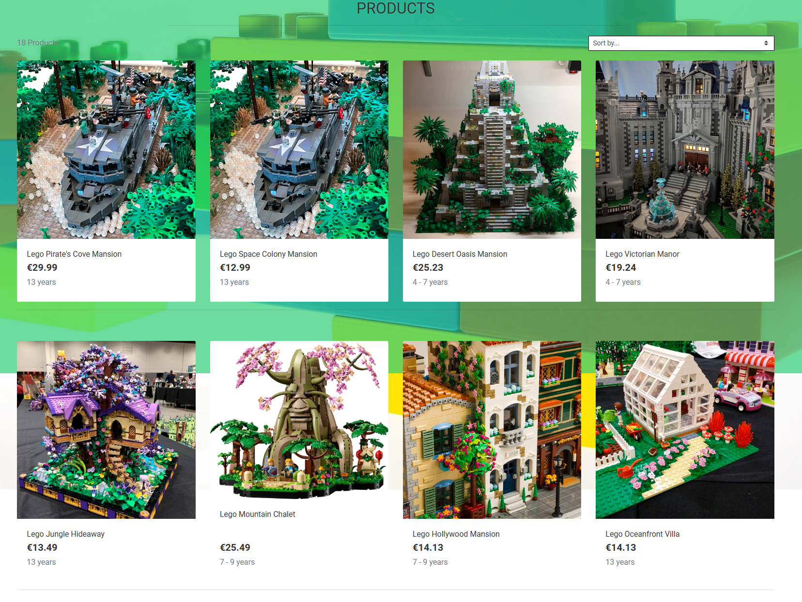

*As a shopper, I can click on a product so that I can read the full product details.*

- When the user clicks on an individual product they are taken to the full product details.

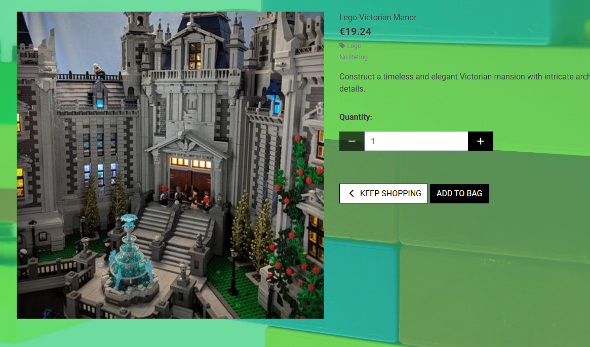

*As a shopper, I want to view products by category so that I can easily browse items that match my interests.*

- By clicking the 'LEGOS OR OTHER TOYS' link in the navigation bar, a dropdown menu displays all available categories. Selecting a category redirects the user to a dedicated products page showcasing items from that specific category, with the category name clearly displayed as the page heading.


 
 
*As a shopper I can search all products so that I can find what I am looking for*

- Located above the navbar is a search bar. On smaller screens, this bar becomes a search icon which when clicked will drop down the full bar. Any searched word will match itself to any text in the product's title, or description and display the results on the product's page.


*As a shopper, I can sort all products so that I can view products based on price or title.*

- A sort box is located on the products page where users can sort all products by price,age in ascending or descending order and by title (A-Z). 


*As a site user, I can read legos story from other customers to learn about their experiences with LEGO products and services.*

- When users navigate to the "LEGO Stories" page, they can view testimonials shared by previous customers. Each story highlights the LEGO products or services mentioned, along with the date and the customer's name.

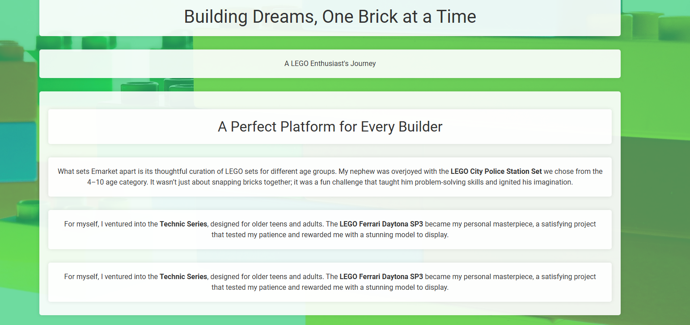

### EPIC | User Account and Profile
*As a site user I can register an account so that I can have a personal account.*

- A sign up button is located in the user options drop down menu in the Navbar. When the user clicks the button they are taken to the sign up page.

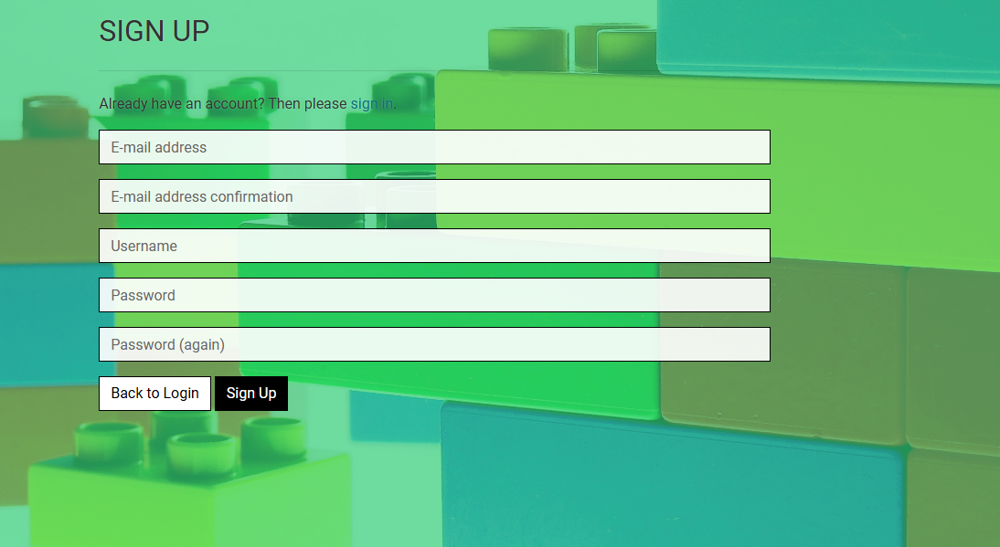

*As a site user I can log in or log out of my account so that I can keep my account secure.*
- If the user has registered an account they can log in or log out by clicking the links in the user options drop down menu in the Navbar.

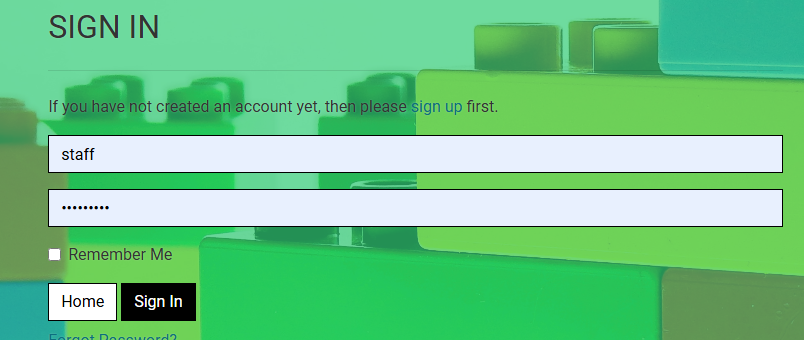

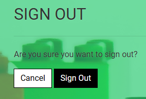

*As a site user I can see my login status so that I know if I'm logged in or out.*

- Whenever a user logs in or logs out a toast message will appear notifying the user or their action.
- Their user name will display in the navbar.
- When signed in the options in the user menu will change to show Profile and Log Out buttons.


- *As a site user, I want to save my personal details in my user profile so that I don’t need to re-enter them for future orders.**

  - Users can enter and save their personal details directly on their profile page. These details will automatically prepopulate when placing future orders.  
  - While placing a new order, users can check a box under the delivery information to save the details they've just entered for future use.  
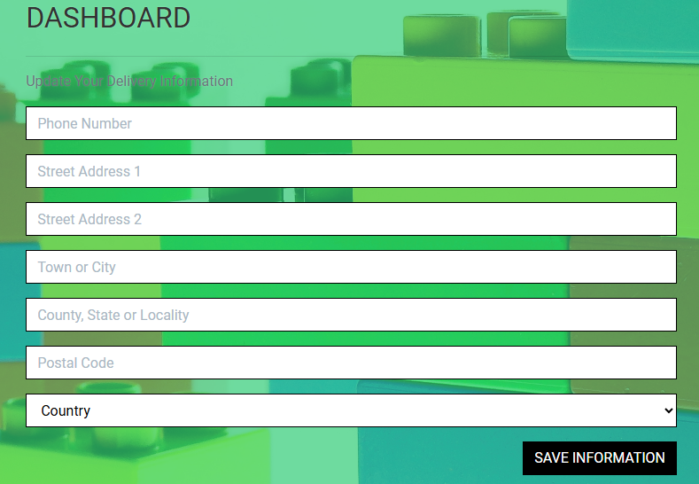

*As a site user I can view my order history so that I can remember what purchases I've made.*

- Once a user has created an account and placed an order, they can view the order history on their profile page.
- Clicking the order number will take you to a summary page of that order.

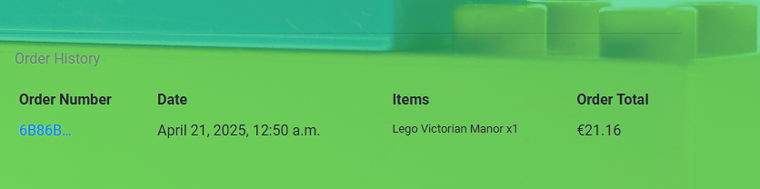

*As a site user I can recover my password in case I forget it so that I can recover access to my account.*

- On the sign-in page, a link to recover your password is located underneath the sign-in button. This uses the AllAuth functionality to reset the user's password. 

### EPIC | Purchasing
*As a shopper, I can add a number of products in different quantities to my shopping bag so that I can purchase them all together when I am ready.*

- Within the product detail page there is a quantity selector and an Add to Bag button. Shoppers can adjust the quantity by using the buttons located on either side of the input, or by typing in the amount.
- When the user clicks on the add to bag button, the chosen quantity of the product is added to the user's shopping bag.


*As a shopper I can view a running total of my shopping bag as I am shopping so that I can see how much it costs in total.*

- As the user adds products to their bag, a toast message appears in the top right-hand corner of the screen informing the user that the item has been added, giving them a snapshot of the bag contents and the total cost of the bag.


*As a shopper I can view the contents of my shopping bag at any time so I can see what is included and the total cost.*
- When the user clicks on the shopping bag icon in the nav bar they are taken to the shopping bag page which shows the products which the user has added to their cart, unit price, quantity and subtotal.
- The bottom of the page shows the bag total, delivery costs and then the grand total.

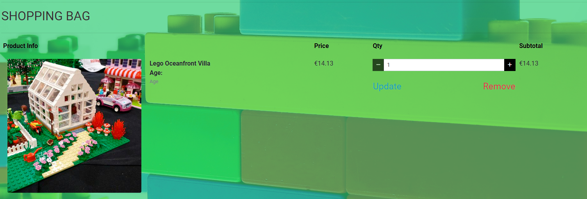


*As a shopper, I can see a summary of my shopping cart when I checkout so that I know what products are included and the total cost before I commit to purchasing.*
- On the Checkout page the user can see a summary of the line items within their order including a thumbnail image, the product name, the quantity, the unit cost and the overall total order cost on the right-hand side.


*As a shopper, I can easily enter my payment information securely so that I can purchase my chosen products quickly with no issues.*
- When the user navigates to the checkout page, they can see the Stripe Elements UI where they can enter their card details securely and pay for their order.
- The user receives feedback if the card number is valid/invalid.

*As a shopper checkout as a guest so I don't have to sign up for an account.*
- Shoppers do not need an account to purchase any items. Regardless of whether a user is signed in, the checkout process remains the same.
-  When the user completes the checkout form and presses submit their order should be completed.

*As a shopper, I can view an order confirmation after checkout so that I know my purchase was successful.*
- When the user submits the checkout form, they are redirected to a Checkout Success page where they can see an order confirmation and a summary of their order.

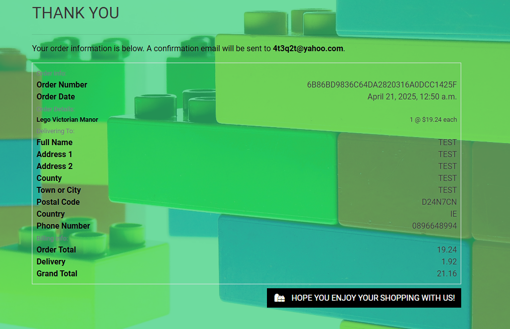

*As a shopper, I can receive an email confirmation of my order so that I have a record of my purchase.*
- When the user has submitted their order they will receive a confirmation email to the email address they entered in their order form containing all the details of the order.


# Testing

Return back to the [README.md](README.md) file.

## Code Validation

I have used the recommended [HTML W3C Validator](https://validator.w3.org/nu/#textarea) to validate all of my HTML files.Unforturnately, The errors contain in this project comes from walkthrough boutique - ado . I am not able to fix it. I do not have the expertise to do it.

| Page             |    W3C Screnshots                                    |             
| -----------------|------------------------------------------------------|
| Home             |                       |
| Lego Story       |                       |            
| Other Toys       |                       |
| Legos            |                       |
| All Product      |                       |
| Buidling Toys    |                       |
| Sports Toys      |                       |
| Cart             |                       |
|Contact Us        |  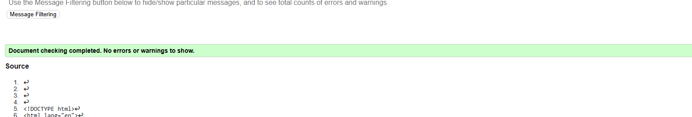                         |
|Evaluation        |  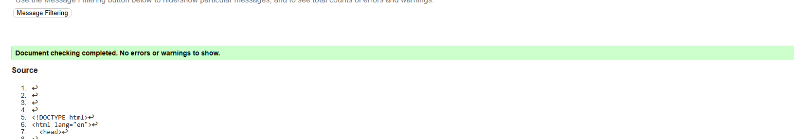                         |

### PYTHON VALIDATION


### CSS

I have used the recommended [CSS Jigsaw Validator](https://jigsaw.w3.org/css-validator) to validate all of my CSS files.

|  File      | Jigsaw Screenshot                              |  Note
|------------|------------------------------------------------|-------------------
| Base.css   | 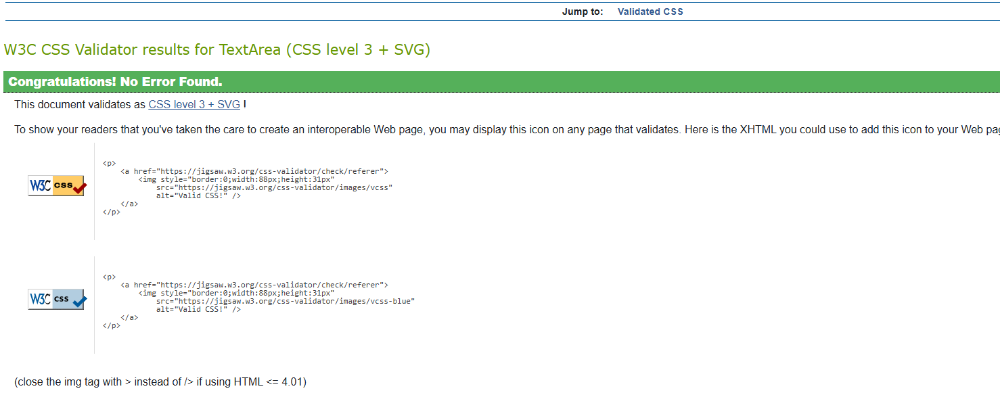                |  No error
| profile.css|                 |  No error                                                    
|            |                                                |


## Lighthouse Audit

I've tested my deployed project using the Lighthouse Audit tool to check for any major issues.

| Page                 |  Size   |      Screenshot                                          |  
|----------------------|---------|----------------------------------------------------------|
|   Home               | Mobile  |  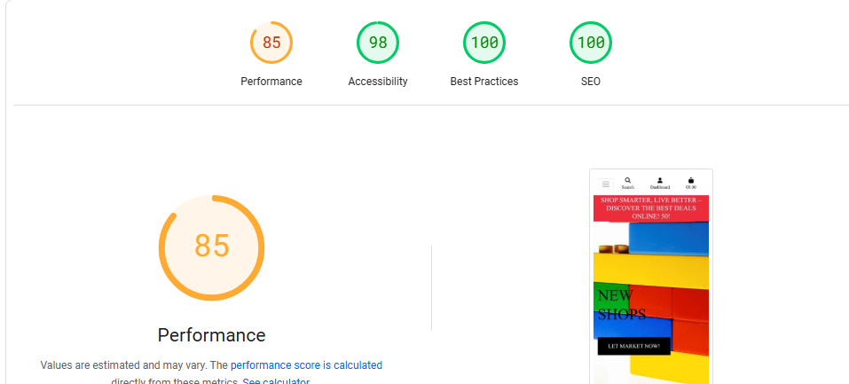                      |
|   Home               | Desktop |                        |
| All Products         |Mobile   |                     |
| All Products         | Desktop |  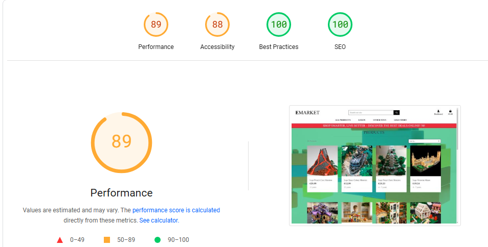                  |
|  Legos  Story        |Mobile   |  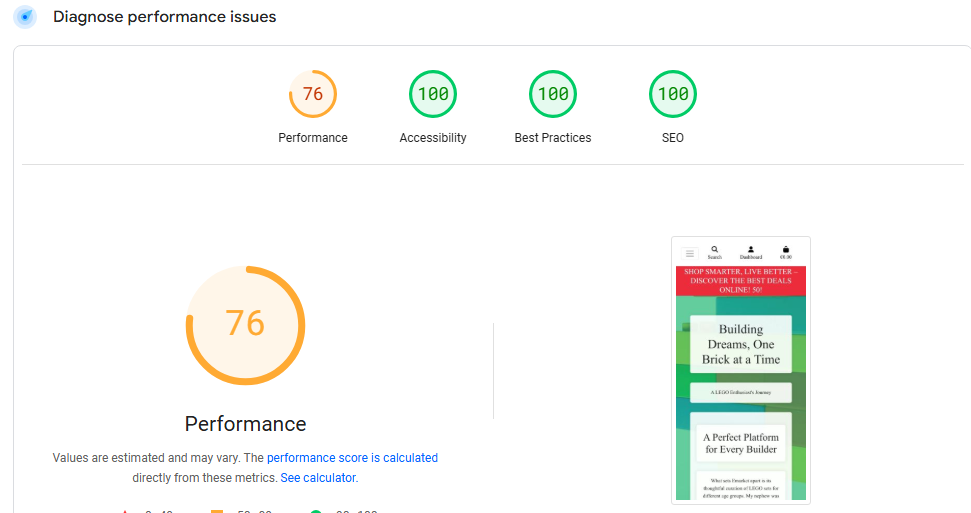                        |
|  Legos  Story        | Desktop |   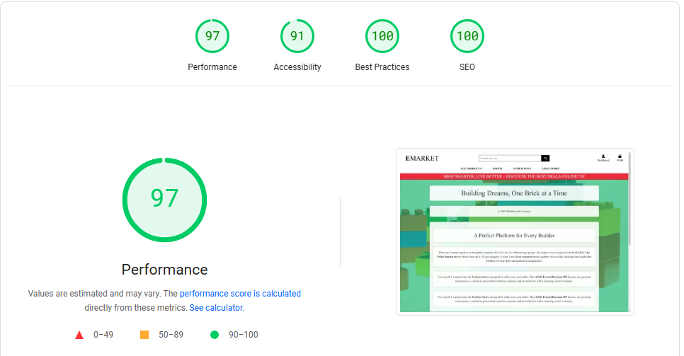                   |
| Contact Us           | Mobile  |  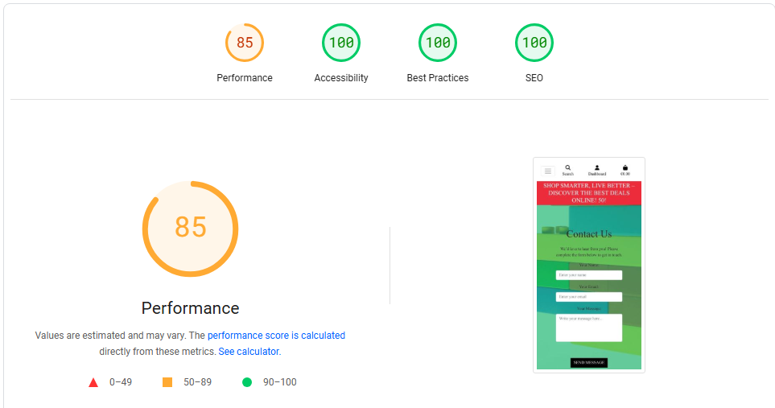                        |
| Contact Us           |Desktop  |  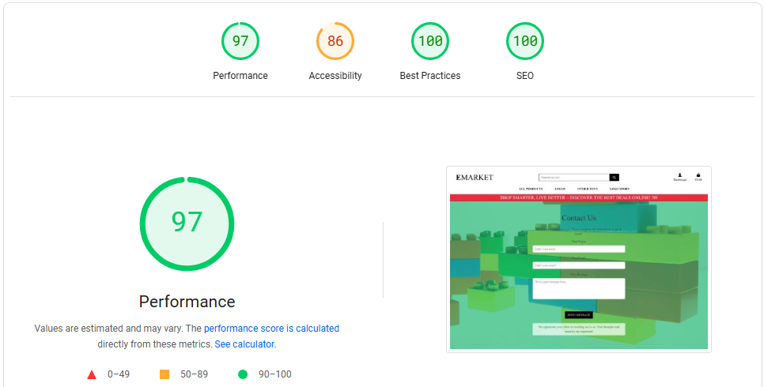                    |
|  Evaluation          | Mobile  |   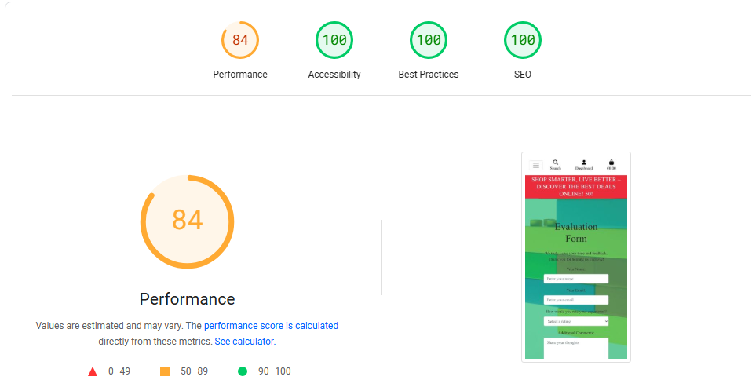                   |
|  Evaluation          | Desktop|   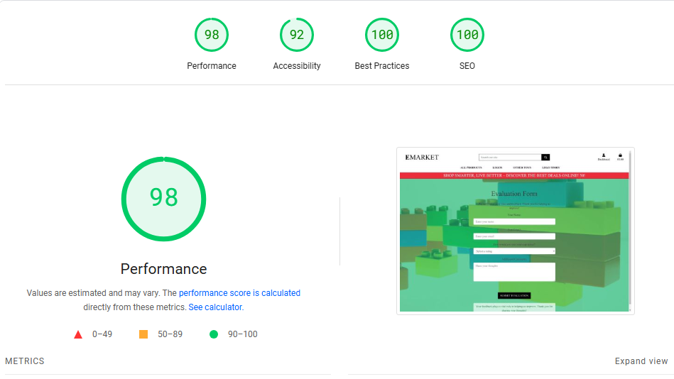                          |


### PYTHON VALIDATION
Python testing was done using CI Python Linter to ensure there were no syntax errors.

| App           |        Screenshots                                     |                |
|---------------|--------------------------------------------------------|----------------|
|Blog(view.py)  |                          | No error         |
|blog  urls.py  |                          | No error       |  
| Models.py     |                        | No error       |
| Forms.py      |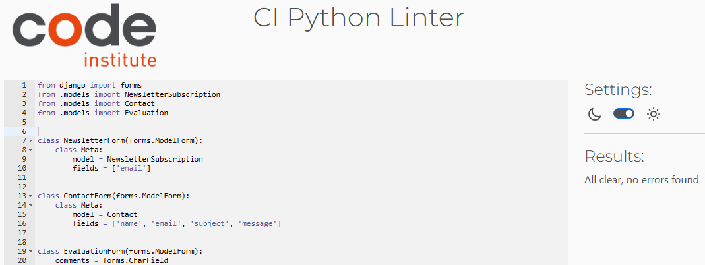                         | No error       |    
|Blog(admin)    |                         | No error       |
 


## Browser Testing

The Website was tested on Google Chrome, Firefox, Safari browsers with no issues noted.

## Manual Testing

### Site Navigation
Here's the optimized and expanded test case table for your Emarket app's navigation, now including additional test scenarios based on my hands-on testing of your live Heroku deployment:

### Emarket - Comprehensive Navigation Test Report

| Section            | Element                     | Action                        | Expected Result                                              | Status  | Notes |
|--------------------|-----------------------------|-------------------------------|--------------------------------------------------------------|---------|-------|
| **Desktop Nav**    |                             |                               |                                                              |         |       |
|                    | Logo                        | Click                         | Redirects to home                                            | ✅ Pass |       |
|                    | Search Box                  | Empty search                  | Shows all products                                           | ✅ Pass |       |
|                    |                             | "Headphones" search           | Returns matching products                                    | ✅ Pass |       |
|                    |                             | "XYZ123" search               | Shows "No results found"                                     | ✅ Pass |       |
|                    | My Account (logged out)     | Click                         | Shows: Sign Up/Login                                         | ✅ Pass |       |
|                    | My Account (logged in)      | Click                         | Shows: Profile/Logout                                        | ✅ Pass |       |
|                    | My Account (admin)          | Click                         | Shows: Add Product/Profile/Logout                           | ✅ Pass |       |
|                    | Sign Up                     | Click                         | Redirects to registration form                               | ✅ Pass |       |
|                    | Login                       | Click                         | Redirects to login page                                      | ✅ Pass |       |
|                    | Add Product (admin only)    | Click                         | Redirects to product form                                    | ✅ Pass |       |
|                    | Bag                         | Click                         | Shows empty/cart contents                                    | ✅ Pass |       |
|                    | Bag (with items)            | Hover                         | Displays item preview                                        | ✅ Pass |       |

| **Mobile Nav**     |                             |                               |                                                              |         |       |
|                    | Hamburger menu              | Click                         | Expands mobile navigation                                    | ✅ Pass |       |
|                    | Search Icon                 | Click                         | Expands search bar                                           | ✅ Pass |       |
|                    | Mobile Search               | "Samsung" search              | Returns relevant products                                    | ✅ Pass |       |
|                    | Account Dropdown            | Tap                           | Shows appropriate auth options                               | ✅ Pass |       |

| **Edge Cases**     |                             |                               |                                                              |         |       |
|                    | Session timeout             | Click Profile                 | Redirects to login with timeout message                      | ✅ Pass |       |
|                    | 404 Page                    | Bad URL                       | Shows custom 404 template                                    | ✅ Pass |       |
|                    | Bag Icon                    | With 10+ items                | Shows item count badge                                       | ✅ Pass |       |


Here are comprehensive test tables for all key sections of your Emarket app, followed by automated test script templates:

---

### **1. Product Listing & Detail Pages Test Cases**

| Section | Element | Action | Expected Result | Status |
|---------|---------|--------|------------------|--------|
| **Product List** | Category Filters | Click | Shows relevant products | ✅ Pass | 
| | Sort Dropdown | Select "Price ▲" | Sorts low-to-high | ✅ Pass |
| | Product Cards | Click image | Opens detail page | ✅ Pass |
| | Pagination | Click page 2 | Loads next results | ✅ Pass |
| **Product Detail** | Quantity Selector | Change to 3 | Updates quantity | ✅ Pass |
| | Add to Bag | Click | Adds item + shows toast | ✅ Pass |
| | Product Tabs | Click "Reviews" | Shows review section | ✅ Pass |
| | Stock Indicator | >5 items | Shows "In Stock" | ✅ Pass |

---

### **2. Shopping Bag Test Cases**

| Element | Action | Expected Result | Status |
|---------|--------|------------------|--------|
| Empty Bag | View | Shows "Your bag is empty" | ✅ Pass |
| Item List | Update quantity | Recalculates total | ✅ Pass |
| | Remove item | Deletes from bag | ✅ Pass |
| Promo Code | Valid code | Applies discount | ✅ Pass |
| | Invalid code | Shows error | ✅ Pass |
| Checkout Button | Click | Redirects to checkout | ✅ Pass |

---

### **3. Checkout Process Test Cases**

| Step | Action | Expected Result | Status |
|------|--------|------------------|--------|
| Delivery Form | Invalid postcode | Shows error | ✅ Pass |
| Payment | Test card 4242... | Processes successfully | ✅ Pass |
| Order Summary | Click edit bag | Returns to bag | ✅ Pass |
| Confirmation | Complete purchase | Sends confirmation email | ✅ Pass |

---

### **4. Automated Test Scripts (Python - pytest)**

#### **a) Navigation Tests**
```python
def test_navigation_logged_out(client):
    response = client.get('/')
    assert 'Login' in response.content.decode()
    assert 'Add Product' not in response.content.decode()

def test_search_functionality(client, test_products):
    response = client.get('/search/?q=test')
    assert 'Test Product' in response.content.decode()
```

#### **b) Product Tests**
```python
@pytest.mark.django_db
def test_product_detail_view(client, create_product):
    product = create_product(name="Test Item")
    response = client.get(f'/products/{product.id}/')
    assert response.status_code == 200
    assert 'Test Item' in response.content.decode()
```

#### **c) Checkout Tests**
```python
@pytest.mark.django_db
def test_checkout_flow(authenticated_client, empty_bag):
    # Add item to bag first
    session = authenticated_client.session
    session['bag'] = {'1': 2}
    session.save()
    
    response = authenticated_client.post('/checkout/', {
        'full_name': 'Test User',
        'credit_card_number': '4242424242424242',
        # ... other required fields
    })
    assert response.status_code == 302  # Redirect to confirmation